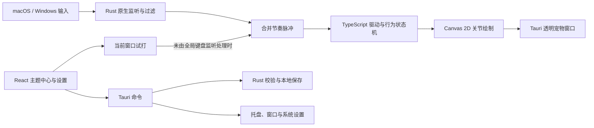

# 狐伴 · FoxBeat

你正常打字，小动物在桌面一角陪你跳舞。现提供紫瞳女孩、表情小狐狸、委屈小狐狸、害羞橙狐、狐狸、小猫咪、月薪喵、水豚与三套舞蹈；舞伴和动作可以在主题中心分别切换。

本仓库为开发预览版。产品需求和技术路线已确认；Windows 实机兼容、完整平台验收、签名、公证与正式发布仍需完成，不能把本地构建结果等同于正式发行。

## 项目文档

- [需求设计 v0.2](docs/foxbeat-product-requirements-v0.2.md)
- [早期需求设计 v0.1](docs/foxbeat-product-requirements-v0.1.md)
- [实现与验证记录](VALIDATION.md)
- [新增舞伴动作预览](companions-preview.png)
- [橙狐连贯帧样片](generated/orange-fox-sway-preview-v3.webp)
- [橙狐眨眼爱心动作样片](generated/orange-fox-wink-light-preview-v1.webp)
- [委屈小狐狸连贯帧样片](generated/reference-motion/shy-fox-sway-preview-v1.webp)
- [月薪喵连贯帧样片](generated/reference-motion/yuexin-cat-sway-preview-v1.webp)

## 能做什么

- 8 位 2D 舞伴 × 3 套舞蹈：左右摇摆、踏步扭扭、挥爪欢跳。
- 新增参考图紫发、紫瞳、辫子与粉紫配色的原创 Q 版女孩；新增大耳朵、尖脸、奶油色面罩的表情小狐狸；新增皱眉白脸的委屈小狐狸、蓝眼捂脸的月薪喵和橙色捂嘴害羞狐。三套参考皮肤使用 Factory `gpt-image-2` 生成的 4×4 十六帧动作套图，包含起势、重心转移、迈步、跳起、挥爪和收势，打包为仓库内置透明位图，保留截图的手绘边缘，不依赖运行时网络。
- 三套参考皮肤都从各自原画制作了清理、对齐的关键帧，并分别配备轻摆、踏步、挥爪三套 24 帧透明位图；Canvas 按独立片段时钟播放单帧，叠加轻微重心起伏，不会把整只角色的相邻姿势半透明叠绘。补帧来自局部形变，不能代替新画的关键姿势。委屈小狐狸的截图原画是半身像，其踏步表现为上身起伏与侧摆，看不到脚步。
- 害羞橙狐的口鼻已从原画里遮嘴的大块白爪中露出，改为胸前小爪；踏步也使用独立的抬腿序列。
- 摸摸害羞橙狐会播放单独的 12 帧眨眼、抬爪、冒爱心动作，然后回到原来的待机或舞蹈；低动态模式使用固定关键姿势。动作沿用橙狐手绘位图风格，图集离线内置。
- 连续舞蹈与逐次步进两种驱动方式；输入会经过起势、律动、收势和恢复阶段，停止输入后自然回到待机或打盹，不会突然跳回第一帧。
- 独立头部、双耳、尾巴、手脚动作，附带眨眼、睡眠呼吸、摸头爱心和低动态模式。
- 透明置顶宠物窗口，直接单击互动、按住身体拖动；移动位置自动保存。无需全局输入监控权限。
- 动物、舞蹈、尺寸、透明度、输入来源、灵敏度和对白开关设置；找回宠物、暂停并隐藏。
- 按首次输入、连续输入、停顿、长时间空闲、摸头、切换主题和启动等匿名事件触发不同小动作；短对白有冷却时间，只使用事件类型，不读取或保存实际输入文字。
- 键盘默认启用；鼠标点击与滚轮默认关闭，分别可选。开机启动由用户主动开启。
- 无账号，内置内容离线可用。对白是本地固定短句，不包含在线主题商城、AI 对话、音乐监听或云同步。

## 技术栈与支持目标

| 层 | 已选技术 |
| --- | --- |
| 桌面壳、窗口与系统能力 | Rust 1.91.1、Tauri 2.12.0 |
| 主题中心和设置 | React 19.3.0、TypeScript 7.0.2、Vite 8.3.1 |
| 动物动画 | Canvas 2D 矢量关节角色、透明位图逐帧与轻量位移 |
| macOS 输入 | 原生只读事件监听与输入监控权限处理 |
| Windows 输入 | 原生低级输入钩子、事件过滤与限速 |
| 本地设置 | Rust 校验后的 JSON 配置及原子保存 |
| 开发与验证 | Node.js 24、npm 锁文件、Vitest、Rust 单元测试 |

运行系统目标：**Windows 10 22H2 x64、Windows 11 x64、macOS 13+（Apple Silicon / Intel）**。Windows ARM64、Linux 与移动端不在本版支持矩阵。Windows 10 是明确的兼容目标，仍需在该系统实机完成验收。

Windows 使用 WebView2；NSIS 配置包含离线安装器，未安装运行时的电脑可通过安装包补齐，因此安装包会额外增加约 127 MB，以最终打包实测为准。macOS 使用系统 WebKit，不打包 Chromium。

桌面宠物使用独立的后台绘制调度：透明窗口即使被 WebKit 标记为 `document.hidden`，收到节奏后也会请求绘制；主题中心预览仍遵守普通页面可见性。macOS 14+ 额外配置关闭 WebView 后台限速。macOS 13 不支持这一系统选项，仍需单独验证后台计时、绘制流畅度和耗电，不能从新系统的结果推定。

macOS 透明 WebView 启用了 `macOSPrivateApi: true`。本版选择官网／独立安装包分发，**不支持提交 Mac App Store**。独立分发仍需要相应的 Developer ID 签名和公证；这些工作尚未完成。Windows 安装包签名也需在正式发布前另行配置。

## 本地运行

开发环境需要：

- Node.js 24（Node.js 26 也满足当前 Vite 的 `^20.19.0 || >=22.12.0` 要求）。
- Rust 1.91.1，建议通过 rustup 管理。
- macOS：Xcode Command Line Tools；需要打包时使用完整的对应系统工具链。
- Windows：Visual Studio 2022 Build Tools 的 C++ 桌面开发组件、Windows SDK 和 WebView2 Runtime。

在包含 `package.json` 的仓库根目录执行：

```sh
npm ci
npm run desktop
```

桌面模式会启动 Tauri 与本地前端开发服务，并按权限状态启动输入监听。macOS 如尚未授权，进入应用内权限引导后再重试。只需要检查界面时使用下面的预览方式。

### 三种验证方式

| 模式 | 系统输入监听 | 桌面宠物窗口 | 保存设置 |
| --- | --- | --- | --- |
| 浏览器界面预览：`npm run dev` | 无 | 无 | 仅预览，不调用原生设置接口 |
| 桌面程序参数 `--preview` | 无 | 无，展示主题中心 | 不读取或写入实际设置，不修改开机启动 |
| 桌面程序参数 `--no-listener` | 无 | 有 | 正常保存；可使用独立配置目录 |

通过 Tauri 开发命令向应用传参时，npm、Tauri 与运行器各有参数分隔符：

```sh
npm run desktop -- -- -- --preview
npm run desktop -- -- -- --no-listener
```

也可以直接对已生成的可执行文件使用 `--preview` 或 `--no-listener`。

`FOXBEAT_CONFIG_DIR` 将配置文件改为指定目录中的 `settings.json`，便于隔离验证。

macOS / zsh 示例：

```sh
FOXBEAT_CONFIG_DIR="$PWD/.local-test-config" npm run desktop -- -- -- --no-listener
```

Windows / PowerShell 示例：

```powershell
$env:FOXBEAT_CONFIG_DIR = Join-Path $PWD '.local-test-config'
npm run desktop -- -- -- --no-listener
Remove-Item Env:FOXBEAT_CONFIG_DIR
```

独立配置目录只隔离应用配置。开机启动属于系统设置；需要完全不改变这些设置时使用 `--preview`。

## 使用方式

1. 在主题中心选择动物与舞蹈。选择“试打互动”后，先点击试打区域，再在当前窗口敲键；也可以播放完整舞蹈。桌面客户端会把当前窗口试打同时传给桌面宠物，无需系统输入监控权限；宠物暂停或隐藏时先恢复陪伴。选择完成后应用到桌面。
2. 大小滑条会实时改变预览大小；在桌面客户端中，也会同步改变桌面小舞伴的尺寸，无需重新应用主题。
3. 回到自己的编辑器、文档或聊天窗口正常输入。陪伴模式下宠物窗口鼠标穿透，不需要先点击它。
4. **直接点击桌面舞伴**即可跳舞、眯眼和冒爱心；**按住身体移动**即可拖动位置。轻微手抖不会触发拖动，拖动结束也不会误触摸摸。主题中心的“调整桌面位置”仍可显示额外拖柄。
5. 舞伴窗口始终接收鼠标，点击时可以获得焦点；程序不会主动抢焦点。移动结束后自动保存位置（通常 5 秒内），正常退出前也会保存。完成调整只收起工具栏，身体仍可点击与拖动。
6. 开会或演示时使用“暂停并隐藏”；位置丢失时使用“找回小动物”。

浏览器页面仅用于试玩：大小滑条只改变页内预览，键盘只响应已点击的试打区域，不能监听其他应用，也不能创建或拖动桌面宠物。跨应用打字跟随和桌面拖动需要正常启动桌面客户端。

当前窗口试打与跨应用输入是两条独立路径。`--no-listener` 仍可在客户端当前窗口试打，但不会监听其他应用；`--preview` 不创建桌面宠物。全局键盘监听已经运行时，试打按键不再额外转发，避免同一次敲键让桌面宠物响应两次。试打成功只能确认当前窗口互动链路，不能证明其他应用中的输入已被监听。

关闭主题中心窗口会收起窗口，应用仍在菜单栏／托盘中运行。完全退出请选择“退出狐伴”。

## 隐私与平台边界

原生层短暂使用物理 keycode 和按下／抬起状态过滤修饰键、快捷键与长按重复，**不把 keycode 转换成输入文字，也不保存逐键记录**。跨越 Rust 与前端边界的是聚合节奏信号，不是键码或文字。应用不读取剪贴板、聊天记录或屏幕内容。

macOS 跨应用输入需要用户允许输入监控。拒绝权限仍可以在当前窗口试打；按引导授权后，原生后台线程每 5 秒检查一次权限是否生效并恢复监听；也可点击“开启打字跟随”立即重试。若系统要求重新打开应用，请按提示操作。未授权时只支持当前窗口试打，切到其他软件不会跟随。macOS 的 TCC 权限独立于应用配置；开发版重新编译或运行身份变化后，应以当前进程重新检查的权限状态为准。看到 `permission_required` 不能沿用上一个开发包的授权结论，必要时按系统提示重新允许并重启应用。Secure Input、密码保护输入和系统保护界面可能不产生反馈。Windows UAC 安全桌面不在覆盖范围；管理员应用、远程桌面和独占全屏游戏需要单独验证。

配置默认写入 Tauri 提供的当前用户应用配置目录，而非安装目录。保存内容为主题、显示偏好、输入开关及宠物位置等设置，不包含输入内容。

开发版诊断会在配置目录覆盖保存 `runtime-diagnostics.json` 的最新聚合快照，用于区分事件发送、接收与绘制阶段。它只包含累计脉冲数、发送错误数、绘制帧数和运行状态，不包含键码或文字；非调试构建不写入该诊断记录。

## 结构与事件链路

```text
frontend/src/
  petRenderer.ts       原创动物与独立关节舞蹈
  engine.ts            输入节奏、逐步/连续驱动、行为状态
  PetCanvas.tsx        动画时钟、Canvas 与设备像素比
  animationScheduler.ts  桌面后台绘制与预览可见性调度
  ...                  主题中心、设置与桌面宠物界面
src-tauri/src/
  input.rs             macOS / Windows 监听、过滤、限速与生命周期
  settings.rs          设置验证和原子保存
  main.rs              IPC、窗口、托盘、自启与应用生命周期
src-tauri/tauri.conf.json
.github/workflows/build.yml
```



## 检查与构建

```sh
npm test
npm run build
cargo test --manifest-path src-tauri/Cargo.toml
```

按当前宿主系统打包：

```sh
# macOS：.app 与 .dmg
npm run bundle -- --bundles app,dmg

# Windows：NSIS 安装器
npm run bundle -- --bundles nsis
```

没有指定 Rust target 时，产物位于 `src-tauri/target/release/bundle/`。CI 显式指定 target，产物位于 `src-tauri/target/<target>/release/bundle/`。

更新已安装的 macOS 客户端时，先执行 `npm run bundle -- --bundles app`，在菜单中选择“退出狐伴”，然后用 `src-tauri/target/release/bundle/macos/FoxBeat.app` 替换 `/Applications/FoxBeat.app` 并重新启动。Tauri 发布版把前端资源嵌入可执行文件；仅执行 `npm run build` 会更新 `dist/`，已安装的客户端仍会运行旧代码。

已提供三平台 GitHub Actions 配置：`windows-2022` 构建 x64 NSIS，`macos-15` 构建 Apple Silicon 应用与 DMG，`macos-15-intel` 构建 Intel 应用与 DMG。macOS 应用以 `.app.tar.gz` 上传，保留可执行权限与符号链接。该工作流仅是仓库配置，本次没有推送、触发 CI 或发布 Release；未配置签名凭据。

此前 5 位舞伴的渲染检查覆盖 2,880 个样本，未发现画布裁切；新增角色仍需补充同等规模的渲染回归检查。[新增舞伴动作预览](companions-preview.png) 展示待机、踏步、挥手与摸头。

此前针对试打不动的原生验证：一次试跳加三次按键成功发送并接收 4 次节奏，发送错误为 0，宠物 Canvas 在低动态模式下实际绘制了 15 帧舞蹈。

上述四次脉冲验证走当前窗口试打路径，`native_pulses=0`；重新编译后的进程仍报告 `permission_required`。跨应用全局输入仍需用户为当前构建授权后单独验收，取消授权时保持未验证。完整证据与平台边界见 [VALIDATION.md](VALIDATION.md)；现有结果不能替代 Windows 实机、多屏恢复、安装／卸载和性能验收。

## 来源与许可

产品交互参考 [月薪喵桌宠](https://github.com/emmett001/YuexinMeow-Desktop-Pet)，其原项目为 Python / PySide6 / PNG 序列帧路线。本项目选用 Rust / Tauri / Canvas，角色与编舞为原创矢量绘制，没有打包月薪喵形象或其配乐素材。项目代码许可见 [LICENSE](LICENSE)。
