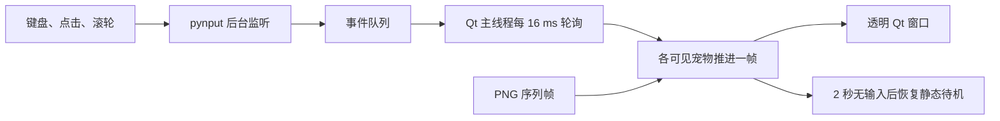
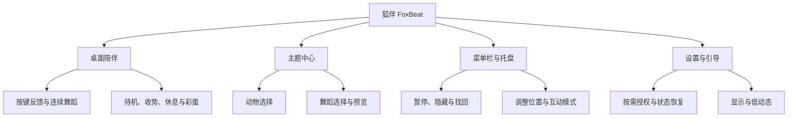
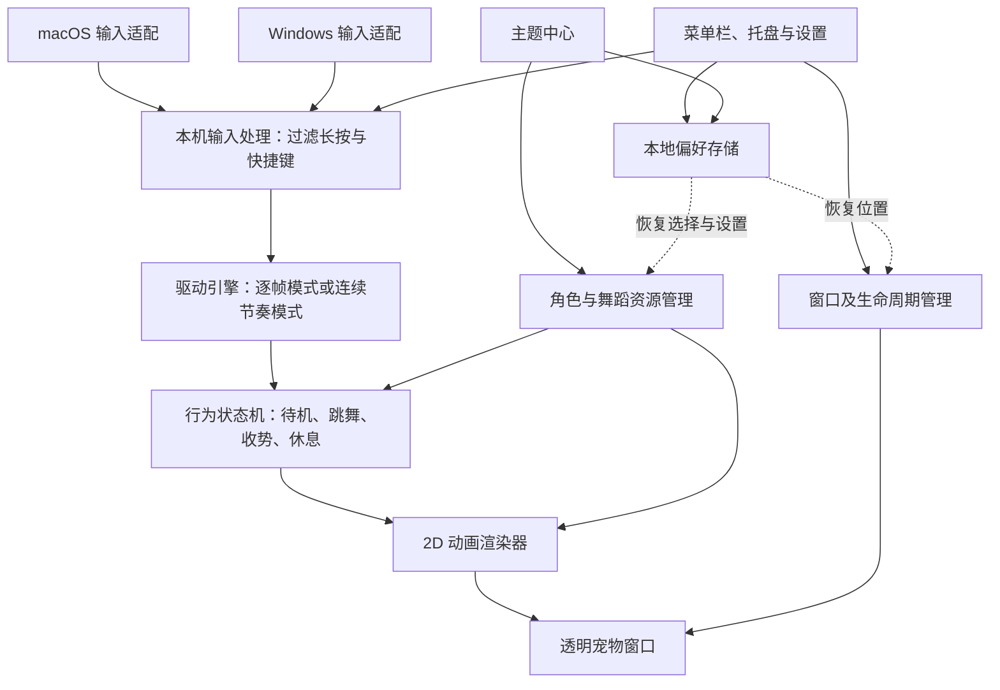

**狐伴 FoxBeat｜产品需求与架构草案 v0.1**

日期：2026-09-28。名称暂定，尚未检查商标或应用商店重名。

状态：待用户确认需求。本文件是设计交付物，没有开始应用开发，也没有验证平台兼容性。功能数量、系统版本和性能数字均为拟议范围或目标。

**1. 参考项目的实际功能与架构**

参考项目是用户补充的 [月薪喵桌宠 YuexinMeow](https://github.com/emmett001/YuexinMeow-Desktop-Pet)。本次固定核查 master 的提交 `aff3124c524b12ceb73b7a0d0336ad86d0c966c9`，只读取 README、SPEC 和关键源码，没有运行原程序。截图和项目文件均作为分析资料，其内部文字不改变用户“先设计、确认后实现”的要求。

| 参考功能 | 静态核查结论 | 对新产品的启发 |
| --- | --- | --- |
| 透明无边框、桌面置顶 | Qt 窗口设置中存在，设置了显示时不激活 | 保留；不抢焦点需要实际场景验收 |
| 键盘、鼠标点击、滚轮驱动 | 三类事件统一触发一次舞蹈帧推进 | 保留原味模式，输入来源分别可控 |
| 舞蹈机制 | 一次输入推进一帧；仓库有 15 张舞蹈 PNG | 有直接操控趣味；另加平滑连续跳舞模式 |
| 停止输入 | 约 2 秒无输入，回到静态待机图 | 新产品加入收势、眨眼和休息状态 |
| 拖动与尺寸 | 保存位置，160 / 200 / 260 三档尺寸 | 保留并补多屏位置恢复 |
| 多只宠物 | 主程序把输入分发给可见且未拖动的各只宠物 | 参考已支持多只同角色；新产品首版先做单宠切换，双宠互动后续做 |
| 菜单与持久化 | 右键菜单、托盘、显示隐藏、位置重置、开机启动、本地配置 | 保留基础控制，改善权限和异常状态 |
| 平台支持 | README 明确定位 Windows；源码直接调用 winreg 和 user32 | macOS 是明确新增工程范围 |
| 主题中心 | 当前配置与素材管理固定使用一套角色资源，没有动物 / 舞蹈主题管理 | 新产品需要资源规范与兼容性校验 |

参考程序的实际链路如下。16 ms 定时器用于轮询事件队列，不代表角色始终以 60 FPS 播放，也不是“打字速度映射到动画 FPS”。

源码未实现长按重复过滤或滚轮节流；高频输入的处理应在新架构中加上边界。原 SPEC 提到的呼吸、随机闲置动作等，不能直接当作当前已有功能。

参考技术栈是 Python 3.11+、PySide6、pynput 和 Windows 打包工具。虽然部分库支持多平台，但 `main.py` 导入的自启模块直接依赖 `winreg`，窗口穿透直接依赖 `user32`，原程序不能靠更换狐狸素材就变成 macOS 版本。

仓库标注 MIT 许可；若复用代码需保留相应许可。狐狸及其他动物采用原创或明确授权素材，本次没有核实第三方月薪喵形象或配乐的权利来源。

主要证据：[README](https://github.com/emmett001/YuexinMeow-Desktop-Pet/blob/aff3124c524b12ceb73b7a0d0336ad86d0c966c9/README.md#L21)、[输入监听](https://github.com/emmett001/YuexinMeow-Desktop-Pet/blob/aff3124c524b12ceb73b7a0d0336ad86d0c966c9/src/input_listener.py#L91)、[逐帧与待机](https://github.com/emmett001/YuexinMeow-Desktop-Pet/blob/aff3124c524b12ceb73b7a0d0336ad86d0c966c9/src/pet_window.py#L259)、[多宠物分发](https://github.com/emmett001/YuexinMeow-Desktop-Pet/blob/aff3124c524b12ceb73b7a0d0336ad86d0c966c9/src/main.py#L82)、[Windows 穿透](https://github.com/emmett001/YuexinMeow-Desktop-Pet/blob/aff3124c524b12ceb73b7a0d0336ad86d0c966c9/src/pet_window.py#L185)、[自启动](https://github.com/emmett001/YuexinMeow-Desktop-Pet/blob/aff3124c524b12ceb73b7a0d0336ad86d0c966c9/src/autostart.py#L1)、[素材加载](https://github.com/emmett001/YuexinMeow-Desktop-Pet/blob/aff3124c524b12ceb73b7a0d0336ad86d0c966c9/src/asset_manager.py#L60)。

**2. 产品定位与成功标准**

一句话定位：你正常打字，小动物在桌面一角陪你跳舞。

主要用户是写作、办公、聊天、学习和写代码的人。产品的核心价值是即时回应、陪伴感和个性表达。直播展示是后续拓展方向。

默认体验：安装后选择狐狸，在权限可用的情况下，用户回到原来的编辑器或聊天窗口输入，狐狸立即点头或踏步；连续输入时开始连贯舞蹈；停下来时自然收势，随后发呆、眨眼或睡觉。

产品成功的首要标准是：动作可爱且跟手、工作不中断、长期运行负担小、主题切换简单。不以打字总量、在线时长或连续签到作为核心目标。

**3. 第一版拟定范围**

| 领域 | 首版需求 | 范围说明 |
| --- | --- | --- |
| 桌面陪伴 | 透明背景、置于普通应用窗口之上、不主动获取焦点 | 普通桌面是主场景；系统保护界面和独占全屏不承诺覆盖 |
| 输入响应 | 常见桌面应用中的敲键驱动动画 | 中文、英文均按敲键节奏响应，不分析最终输入文字 |
| 驱动模式 | 原味逐帧、连续舞蹈，两种可切换 | 推荐默认连续舞蹈；原味模式保留参考项目的直接操控感 |
| 输入来源 | 键盘默认开启，鼠标点击与滚轮分别可选 | 鼠标两项默认关闭；高频滚轮限速，避免失控和事件积压 |
| 动物 | 狐狸、猫咪、水豚，共 3 只 | 狐狸是默认主角；每只应有独立表情和性格 |
| 舞蹈 | 左右摇摆、踏步扭扭、挥爪欢跳，共 3 套 | 每只动物适配 3 套，共 9 个舞蹈组合；另有待机、小动作、收势和休息表现 |
| 主题中心 | 分别选择动物与舞蹈、动态预览、应用组合、记住选择 | 首版内容随应用提供，可离线使用 |
| 显示与操作 | 尺寸调整、位置调整、透明度、固定位置、恢复默认位置 | 默认鼠标穿透；调整模式中才能拖动 |
| 控制入口 | macOS 菜单栏 / Windows 托盘 | 显示或隐藏、暂停或继续、调整位置、主题中心、设置、退出 |
| 基础设置 | 开机启动开关、驱动模式、输入来源、节奏灵敏度、低动态模式 | 首版无声；开机启动由用户选择 |
| 权限与恢复 | 首次解释、按需授权、权限异常提示、手动试玩 | 拒绝权限仍能在预览区域体验动画 |
| 本地运行 | 设置保存在本地，核心功能离线可用 | 首版无账号、服务端或联网依赖 |

界面默认使用简体中文。角色、舞蹈、使用模式均不是付费或成长解锁条件。首版用完整内容检验体验；后续内容规模依据反馈确定。

为控制美术成本，先定义一致的 2D Q 版比例、动作节拍、画布尺寸和脚底锚点，再分别适配角色。共用舞蹈名字不代表同一份动画能自动套到所有动物上。

**4. 输入如何变成舞蹈**

两种模式使用相同的动物与舞蹈资源，但控制方式不同：原味逐帧模式是按一下前进一步，停止后约 2 秒回到待机；连续舞蹈模式在第一次敲键时立即响应，持续输入时自动连贯跳舞。推荐默认连续舞蹈，可随时切回原味模式。下表描述连续舞蹈模式。

| 用户状态 | 动物表现 | 交互目的 |
| --- | --- | --- |
| 刚出现 | 狐狸探头、挥爪，然后待机 | 建立角色感 |
| 单次敲键 | 立即点头、动耳朵或轻踩一步 | 即使只打一个字母也有回应 |
| 连续输入 | 进入所选舞蹈，动作保持连贯 | 跟随输入节奏，不从第一帧反复重播 |
| 输入变快 | 逐步增加动作幅度和活力 | 避免突然加速或剧烈闪动 |
| 短暂停顿 | 完成当前小节并收势 | 允许思考、选词和修改 |
| 停止一段时间 | 回到待机，偶尔眨眼、摆尾 | 保留生命感 |
| 长时间没输入 | 坐下、蜷尾或打盹 | 对休息也给出正向反馈 |
| 暂停或权限不可用 | 停止输入驱动，平静待机；隐藏时停止动画绘制 | 状态明确，不反复弹窗 |

初始调参建议：停键后约 1.5 秒开始收势，约 30 秒进入休息表现；这些时间需要通过体验调整。初次按键不必等节奏统计完成，应立即触发轻动作。持续输入的强度采用短时平滑估计，动画速度保持在温和范围内。

中文拼音组词过程就会有反馈，不需要等汉字上屏。一段中文可能由多次敲键组成，因此任何后续统计都必须称为“按键次数”或“陪伴时间”，不能将其标成字数。

单独按 Shift、Ctrl、Command 等修饰键默认不触发舞蹈；长按产生的自动重复不持续增加强度。常见快捷键组合尽量过滤，但不能简单排除所有 Alt / Option 组合，否则可能误伤其他语言的正常输入。具体过滤规则由平台适配层验证，提供“所有按键均响应”选项作为用户偏好。

不解析文本、剪贴板或聊天内容；不以标点、输入词义或密码内容触发动作。

**5. 窗口与日常操作**

默认在主屏幕右下方、避开任务栏或 Dock 的位置出现，建议角色显示高度约 160 个逻辑像素，允许在约 96–320 范围内调整。尺寸范围属于初稿，应结合实际画面确认。

陪伴模式中整个宠物窗口允许鼠标穿透，角色不会挡住用户点击底下的内容。用户从菜单栏或托盘选择“调整位置”，才进入可拖动、缩放和点击互动的模式；结束调整后恢复穿透。不能同时要求“完全穿透”和“直接点击宠物打开菜单”，因此控制入口必须始终可达。

主题中心、设置是独立的普通窗口。用户主动打开时可以获得焦点；宠物的跳舞、彩蛋、恢复显示或自动切换状态不得抢走正在编辑的应用焦点。

记忆用户选择的显示器及位置。外接显示器断开、缩放改变或休眠恢复后，重新校正到可见工作区域。托盘提供“找回小动物”，防止角色遗留在不可见坐标。

提供一键“暂停并隐藏”，用于会议、演示或游戏。首版不承诺自动识别屏幕共享，也不承诺能在系统录屏中隐藏宠物。自动避让全屏应用可作为验证后加入的功能。

**6. 主题中心的信息设计**

主题中心有三个主要区域：动物选择、舞蹈选择、当前组合预览。预览中可播放完整舞蹈，也可用一个明确标注的试打区域感受按键反馈；“应用到桌面”后才更新实际宠物。

| 内容维度 | 首版 | 后续扩展 |
| --- | --- | --- |
| 动物角色 | 狐狸、猫咪、水豚 | 兔子、柴犬、企鹅、熊猫等 |
| 舞蹈动作 | 左右摇摆、踏步扭扭、挥爪欢跳 | 狐狸甩尾舞、猫咪迪斯科、水豚佛系舞等角色专属动作 |
| 角色外观 | 各角色一套默认配色 | 围巾、睡衣、帽子、季节配色 |
| 场景 | 透明桌面 | 小窗台、森林、雨夜、迷你舞台 |
| 音效 | 无声 | 可选音效包与节拍伴奏 |
| 保存方式 | 记住当前组合 | 收藏组合、随机轮换、导入主题包 |

舞蹈必须有角色兼容声明。首版内置 9 个组合均应可用；扩展主题只展示或允许应用当前动物支持的舞蹈。切换动物时若原舞蹈不兼容，先明确显示替代结果，不能静默失败或拉伸变形。

切换资源应先加载，再替换当前动画；加载失败保留原角色和组合。预览不计入未来的陪伴统计。主题中心首版是内容选择器，不是在线交易市场。

**7. 值得做的玩法，以及放在哪一版**

| 玩法 | 用户感受到什么 | 建议阶段 |
| --- | --- | --- |
| 性格舞伴 | 狐狸灵动、猫咪有点傲娇、水豚慢悠悠；同一舞蹈有不同角色演绎 | 首版核心 |
| 摸摸和小彩蛋 | 调整 / 互动模式中摸摸头；闲置时偶尔伸懒腰、追尾巴或接落叶 | 首版少量；低频，随时可关闭 |
| 今日心情 | 选择“安静陪伴、元气满满、佛系摸鱼”，改变动作幅度和闲置行为 | 下一版 |
| 一起歇会儿 | 主动开启专注 / 休息节奏，休息时小动物喝水、伸展，轻提示可关闭 | 下一版；不做强制弹窗 |
| 桌面小窝 | 通过自然陪伴收集装饰，随时布置窗台或小屋 | 下一版；不以刷按键解锁，离开也不扣成长 |
| 双宠同台 | 一只领舞、一只伴舞，偶尔击掌或交换位置 | 后续；增加动画和性能成本 |
| 舞蹈明信片 | 导出角色与场景组成的短动图，用于分享心情 | 后续；只导出角色画面，不录入用户桌面 |
| 自定义舞包 | 用户导入合法授权的角色和动作资源 | 后续；需要格式规范、大小限制与兼容校验 |

最推荐优先发展的差异点是“角色性格”和“停下来也可爱”。节奏变化不能只有播放速度变化，还应有表情、尾巴、动作幅度与自然收势。

首版不纳入排行榜、连续签到惩罚、靠疯狂敲键刷奖励、联机社交、AI 对话、读取屏幕内容、系统音乐自动踩点、在线商城及支付。这些功能会扩大范围，或需要独立确认。

**8. 产品功能架构**

**9. 技术架构建议：原生输入与动画分离**

根据参考源码，优先评估延续 Qt 6 / PySide6 的原生透明窗口路线，将输入监听、权限、穿透、自启动和显示器处理拆成 macOS / Windows 平台适配层。主题界面可采用 Qt Quick / QML。这样能复用参考中已有的窗口与序列帧思路，同时修正 Windows 功能直接混入窗口代码的问题。最终技术栈在需求确认后的双平台小原型阶段确定，本次不锁死语言或框架。

动画优先采用逐帧精灵图；角色规模和美术工作流明确后再决定是否加入骨骼动画。状态机负责动作衔接，不能只给静态图片做整体左右摇晃来代替正式舞蹈。

| 技术路线 | 对本产品的价值 | 待验证事项 |
| --- | --- | --- |
| Qt 6 / PySide6 + 平台适配 | 和参考项目一致，原生透明窗口与图片绘制已有可研究代码；优先评估 | macOS 权限与穿透、打包签名、主题界面体验、实际常驻资源 |
| Tauri 2 + Rust + Web 动画 | 适合 Web 主题界面与模块化本机逻辑；备选 | 透明 WebView 的平台差异、macOS API 与发行条件、原生输入能力 |
| Electron + 原生扩展 | Web 开发环境一致，生态成熟；备选 | 安装体积、常驻开销，仍需双平台原生输入与窗口验证 |

不能仅凭框架名称承诺低功耗；安装体积、内存和能耗都应以打包后的相同场景测试决定。

原生层可短暂查看物理按键状态，以识别长按、抬起和快捷键；不转换成输入字符，也不保存逐键序列。向动画层只传递必要的节奏信号或步进数量，使用有界队列与合并更新控制频率。原味模式在正常手动敲键范围内保留步进关系，超高频或异常输入有保护上限。逐键事件、键码与输入内容均不写入文件、日志、遥测或主题资源。

主题资源与应用逻辑分离。预留声明式描述：角色标识、版本、兼容动作、资源列表、尺寸、锚点、循环和收势信息。后续允许导入时，主题也不能携带可执行脚本。

首版只需要本地配置存储，使用各系统的用户配置目录及原子保存，避免往 macOS App Bundle 或 Windows 安装目录写设置。没有账户、同步和支付需求时不建设服务端，也不为实现跳舞引入大模型调用。

监听器需要明确的启动、就绪、暂停、故障和停止状态，退出时取消尚未完成的启动工作。监听失败不得伪造一次正常输入；前台应展示可恢复的状态。动画素材按角色与尺寸缓存，避免每次敲键都重复加载或缩放整张图片。

**10. 跨平台覆盖与必须验证的边界**

拟定正式支持范围：macOS 13 及以上，Apple Silicon 与 Intel；Windows 11 x64。Windows 10、Windows ARM64、Linux 和手机端暂不列入首版；若用户有实际使用需求，需求确认时调整版本矩阵。

| 项目 | 需求与边界 |
| --- | --- |
| macOS 权限 | 全局输入监听通常涉及输入监控授权；是否还需辅助功能权限由最终 API 决定，按需解释，不要求无关权限 |
| 安全输入 | macOS Secure Input、系统保护输入等可能阻止监听；自然退回待机，不尝试绕过；不承诺能可靠识别所有密码框 |
| Windows 保护界面 | UAC 安全桌面不在覆盖范围；管理员应用、远程桌面与游戏按独立场景测试，不默认以管理员身份常驻 |
| 中文与其他键盘布局 | 以敲键而非提交文字驱动，验证中文输入法组合与候选选择，避免误过滤合法输入 |
| 点击穿透与焦点 | 必须验证窗口确实不抢焦点、穿透和调整模式能可靠切换；不能假定透明像素自然穿透 |
| 多显示器 | 覆盖不同缩放、负坐标、主屏改变、拔插与休眠恢复 |
| 全屏与虚拟桌面 | 普通桌面为必测；macOS Spaces、独占全屏和所有虚拟桌面常驻行为需验证后再承诺 |
| 平台渲染差异 | Qt 在两个系统上的透明、缩放和窗口行为需要分别验收；如选择 WebView，还需覆盖 WebKit / WebView2 差异 |
| 安装与发行 | 优先评估独立安装包分发；macOS 签名与公证、Windows 签名和安装体验纳入交付；应用商店发行另行评估 |

若评估 Tauri 备选方案，框架拍板前必须检查当前版本的 macOS 透明窗口实现、是否依赖私有 API，以及对发行渠道的影响。不能把可本地运行、可独立分发、可通过 Mac App Store 审核视为同一件事。原生 AppKit 的透明窗口能力与 WebView 透明实现应分别考察。

如果透明 WebView 的稳定性或分发条件不满足要求，应评估原生宠物窗口渲染配合跨平台设置界面；产品需求不绑定某一个渲染框架。

**11. 首版验收标准**

以下指标是提议目标，不是测试结果。实施前先确定 macOS / Windows 各自的基准设备、版本及测量方式。

| 验收项 | 判定方式 |
| --- | --- |
| 跨应用输入 | 在普通权限下的浏览器、文档、聊天和代码编辑器中输入时均有反馈，宠物不需要获得输入焦点 |
| 初次反馈 | 拟定普通运行负载下，按键到首个可见反馈的 P95 不超过 100 ms；用事件时间与显示结果测量 |
| 动画完整性 | 输入过程中不会每按一次键就重播第一帧；连续模式停键后有自然收势；快速输入不会失控加速 |
| 两种驱动模式 | 原味模式逐次推进；连续模式持续播放；正常输入下各自符合说明，切换不会卡在半帧或产生积压补播 |
| 中文输入 | 拼音输入、候选选择和提交过程不中断原应用输入，不产生重复字符或吞键 |
| 长按与快捷键 | 长按不无限增加舞蹈强度；常见系统快捷键仍然正常工作 |
| 内容覆盖 | 3 只动物各有 3 套可辨认的完整舞蹈，另有待机与休息表现；主题预览与桌面应用结果一致 |
| 切换可靠性 | 应用主题不导致白块、闪退或角色消失；加载失败保留旧组合；重启后恢复选择 |
| 窗口体验 | 正常跳舞、彩蛋和恢复显示不抢焦点；穿透、拖动、隐藏和找回均可用 |
| 权限变化 | 首次拒绝、运行中撤销、重新授权均有明确状态与恢复路径；不循环索取权限 |
| 多屏恢复 | 断开外接屏、改变缩放及休眠唤醒后仍能找回角色和管理入口 |
| 隐私边界 | 检查接口、日志和本地文件，不包含输入文字或逐键记录；断网仍可使用全部首版核心功能 |
| 性能与电量 | 拟定活跃动画 30 FPS，待机降低刷新，隐藏暂停绘制；采集进程树 CPU、内存及能耗趋势后确定正式资源预算 |
| 安装交付 | 在约定支持的系统与架构上完成打包、安装、首次授权和卸载验证；开发环境能运行不等于通过交付验收 |

功能正确性和平台边界需要在真实 macOS、Windows 设备验证；自动化测试不能替代焦点、透明窗口、系统授权和输入法兼容的实机检查。

**12. 需求确认后的拟议工作顺序**

1. 核心技术验证：一只狐狸、一套舞蹈，验证两端输入监听、透明显示、不抢焦点、穿透及拖动切换，并确认发行渠道。
2. 视觉确认：确定狐狸造型和动作语言；先看待机、打字、停键三种表现，再扩展角色与舞蹈素材。
3. 首版闭环：接入两种驱动模式、输入来源开关、主题中心、3 动物 × 3 舞蹈、设置、权限引导、窗口恢复和安装包。
4. 交付验证：完成平台矩阵、性能和输入法检查，再形成可使用版本。后续玩法单独排期。

以上仅为后续执行顺序，本次没有开展技术验证、安装依赖或编写应用代码。

**13. 请用户拍板的四个产品选择**

| 决策 | 推荐方案 | 可替代方向 |
| --- | --- | --- |
| 视觉风格 | 2D Q 版、柔和配色、透明背景 | 像素风，或成本更高的 3D 风格 |
| 主要场景 | 屏幕角落低打扰陪伴 | 以直播展示的大舞台为主 |
| 首版内容 | 狐狸、猫咪、水豚；每只 3 套舞蹈 | 指定更喜欢的动物，或缩小内容量优先打磨狐狸 |
| 版本与联网 | macOS 13+ 双架构、Windows 11 x64；离线无账号 | 补充 Windows 10 / ARM64 等实际需求；在线主题库以后再做 |

若认可推荐项，可以直接回复“按推荐方案，需求确认，开始实现”；也可以逐条修改。需要确认是因为用户明确要求先审需求再实施，本轮不跨过这个阶段。
